# Projet de developpement des pipelines ETL

## Context du Projet

Ce projet a pour objectif de centraliser et harmoniser les données clients issues de plusieurs systèmes d’information (CRM, ERP et E-Commerce) afin de disposer d’une base de données consolidée et cohérente pour l’analyse et la prise de décision.

Les données clients étant réparties sur plusieurs sources et dans des formats différents, un processus ETL (Extract – Transform – Load) a été mis en place à l’aide d'un outil' pour automatiser leur intégration et assurer la qualité du résultat final.

## Outils et Technologies

**1. TALEND Open Studio 8.1 : Environnement de développement ETL**

**2. Java (déjà intégré dans TALEND)**

**3. MySQL : Stockage et consolidation des données transformées**

**4. dbdiagram.io : Visualisation du schéma relationnel**

## Objectifs du projet
1. Création d'un environnement ou d'un job dans TALEND
2. Import et analyse de profilage de données
2. Création du schéma sur dbdiagram.io
3. Structure de la base de données
4. Transformation de données (Normalisation) 
5. Chargement du résultat final dans la base de données MySQL 

## Création d'un environnement ou  d'un job dans TALEND

## Import et analyse de profilage de données

**Extraction**

Les données proviennent de plusieurs sources hétérogènes :

- CRM : informations clients et historiques de contact,
- ERP : données de facturation et de ventes,
- E-Commerce : informations sur les commandes et nouveaux clients.

Ces fichiers sont importés dans Talend Open Studio depuis un format CSV.

Après la création de l’environnement, charger les fichiers CSV en utilisant le composant tFileInputDelimited. Pour le faire, aller dans “Palette” à droite de et taper le nom du composant et faire glisser dans le job.

Double cliquer sur le composant, et charger le fichier comme indiqué ci-dessous.

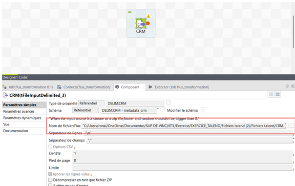

Après chargement des fichiers, il est possible de modifier le schéma en allant dans “Modifier le schéma”.

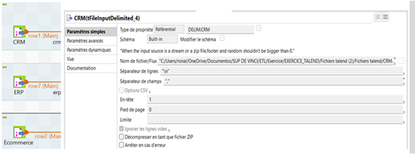

**Analyse de profilage**

Après le chargement des fichiers CSV dans le job Talend, un profilage de données est effectué pour nous  permettre de savoir si les fichiers contiennent des clients ou des transactions en double ainsi que vérifier les formats ou les types de données de chaque source de données.

Après profilage, nous avons observé que,  
- le fichier venant de la source CRM contient des doublons
- certains clients du fichier ERP et du fichier Ecommerce n'existent pas dans le CRM
- les fichiers contiennent des informations différentes
- les types de données sont à normaliser

## Création du schéma sur dbdiagram.io

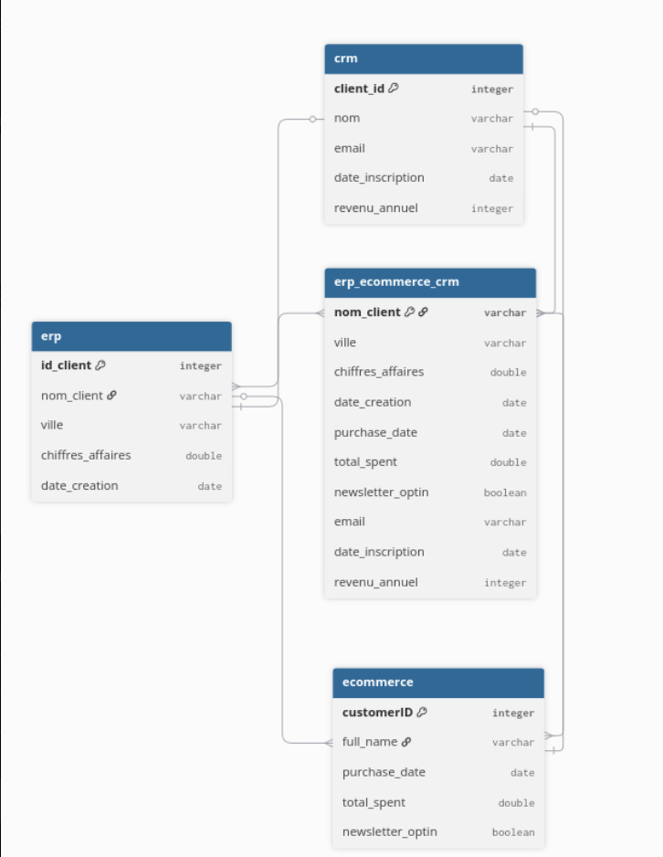

## Structure de la base de données

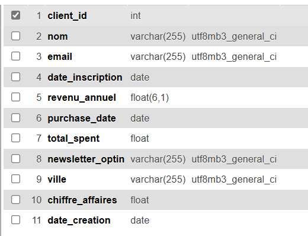

## Transformation de données (Normalisation) 

**Flux de transformation du nouveau fichier clients**

Après l’analyse de profilage des données, nous avons créé un premier flux destiné à générer un nouveau fichier clients en fusionnant les clients qui n’existent pas encore dans le CRM.
Dans ce flux, nous avons utilisé les composants tMap, tUniqRow et tUnite.
Étant donné que les client_id diffèrent d’une source à l’autre, nous avons basé la correspondance sur le nom du client et l’adresse e-mail.
Le composant tUniqRow nous a permis de corriger les doublons présents dans le CRM.

**Flux de transformation des 3 fichiers**

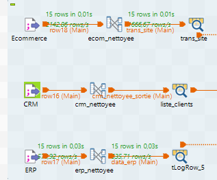

Dans notre composant tMap il nous est aussi possible de normaliser et standardiser à l’aide d’expressions nos données, ces expressions sont faites à partir de fonctions en Java, car c’est aussi le moteur de TALEND, donc il interprète ce langage.
Par exemple en entrée nous avons des données de type String mais nous souhaitons les faire sortir au format Date, pour que nos données soient bien interprétables par la suite depuis notre base de données, voici un exemple:

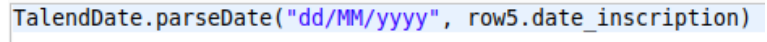

Cela prend une date au format String et la retourne au format Date. 

Il nous est aussi possible de gérer les espaces en trop, ou encore les valeurs nulles, voici un autre exemple d’expressions permettant de le faire:

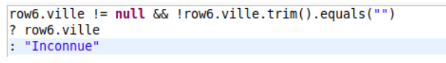

Si nous avons une valeur nulle ou vide comme “” nous affichons “Inconnue” sinon nous affichons le nom de la ville.
Cela permet de ne pas se retrouver avec des valeurs non voulues dans notre base de données.
Pour finir voici un dernier exemple montrant la conversion de nos données du type String vers le type Float:

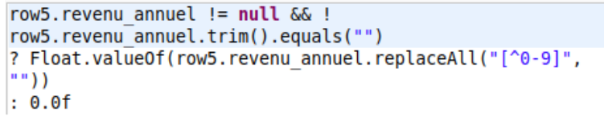

Si le revenu annuel est nul ou vide, on affiche 0.0 au format float, et en utilisant une regex (expression régulière) permettant de ne garder que les chiffres d’une chaîne de caractères et de remplacer tous les autres caractères par du vide “”, alors nous obtiendrons la possibilité de ne garder que le chiffre de ce genre de données au format non normé : 

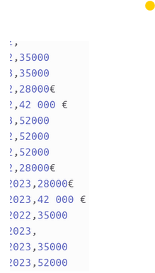

### Jointures

Concernant les jointures des données clients, nous avons fusionné les fichiers issus de différentes sources, en gérant les cas suivants :
- Les colonnes différentes entre les fichiers,
- Les identifiants clients (client_id) distincts pour chaque système.

Pour effectuer les jointures, nous avons utilisé le composant **tMap**. Chaque flux d’entrée (CRM, ERP et E-commerce) a été relié à l’aide de clés communes - telles que le nom du client. 

Pour afficher nos données nous utilisons le composant tLogRow qui permet d’afficher l’état de notre flux de données à des moments précis, on peut donc voir le changement de nos données pendant l’étape de transformation.

Voici à quoi ressemble le flux de jointures.

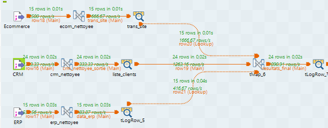

**tMap** 

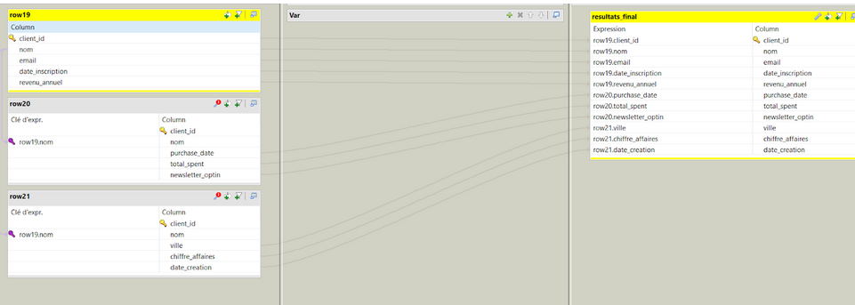

### Tableau Final

Pour afficher nos données nous utilisons d’abord le composant tLogRow qui permet d’afficher l’état de notre flux de données à des moments précis, on peut donc voir le changement de nos données pendant l’étape de transformation.
Voici à quoi ressemble ce composant et comment il est utilisé simplement dans TALEND:

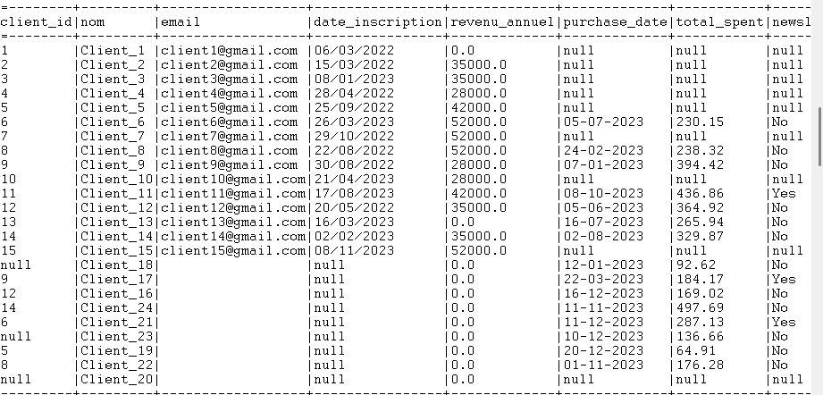

## Chargement du résultat final dans la base de données MySQL

