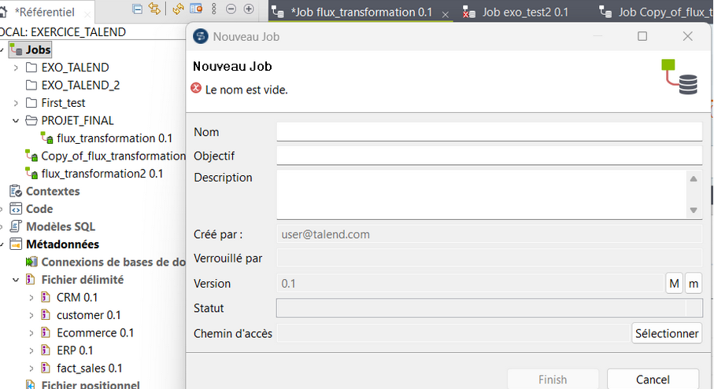
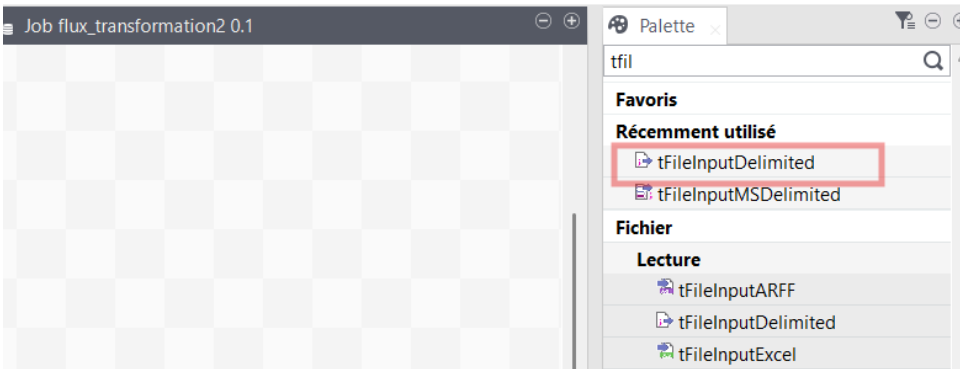

# Projet de developpement des pipelines ETL

## Context du Projet

Ce projet a pour objectif de centraliser et harmoniser les données clients issues de plusieurs systèmes d’information (CRM, ERP et E-Commerce) afin de disposer d’une base de données consolidée et cohérente pour l’analyse et la prise de décision.

Les données clients étant réparties sur plusieurs sources et dans des formats différents, un processus ETL (Extract – Transform – Load) a été mis en place à l’aide d'un outil' pour automatiser leur intégration et assurer la qualité du résultat final.

## Outils et Technologies

**1. TALEND Open Studio 8.1 : Environnement de développement ETL**

**2. Java (déjà intégré dans TALEND)**

**3. MySQL : Stockage et consolidation des données transformées**

**4. dbdiagram.io : Visualisation du schéma relationnel**

## Objectifs du projet
1. Création d'un environnement ("job") dans TALEND
2. Import et analyse de profilage de données
2. Création du schéma
3. Structure de la base de données
4. Transformation de données (Normalisation) 
5. Chargement du résultat final dans la base de données MySQL 

## Création d'un environnement ou  d'un job dans TALEND

## Import et analyse de profilage de données

Après la création de l’environnement, charger les fichiers CSV en utilisant le composant tFileInputDelimited. Pour le faire, aller dans “Palette” à droite de et taper le nom du composant et faire glisser dans le job.

Double cliquer sur le composant, et charger le fichier comme indiqué ci-dessous.

Après chargement des fichiers, il est possible de modifier le schéma en allant dans “Modifier le schéma”.

)

**Extraction (Extract)**

Les données proviennent de plusieurs sources hétérogènes :

- CRM : informations clients et historiques de contact,
- ERP : données de facturation et de ventes,
- E-Commerce : informations sur les commandes et nouveaux clients.

Ces fichiers sont importés dans Talend Open Studio depuis un format CSV.

## 

4. Structure et Traitement des Flux de données
   ### - Import de données
   ### - Transformation de données (Normalisation)
       - Gestion des valeurs nulles
       - Formatage
   - Jointures
   - Chargement de données dans une base de données
## 5. Résultat final dans la base de données

